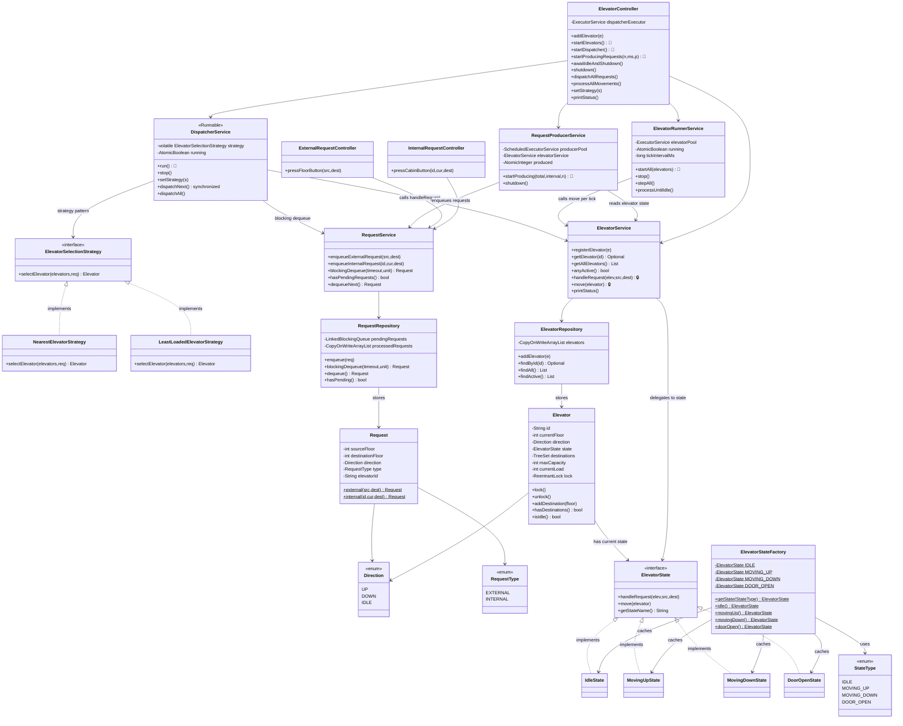

# 🛗 Elevator System — Low Level Design

A complete elevator system implementing **State Pattern**, **Strategy Pattern**, and **Factory Pattern** with a clean layered architecture (Controller → Service → Repository) and **full thread-safety** with a **Producer-Consumer** concurrent architecture.

## Design Patterns Used

| Pattern | Purpose | Classes |
|---------|---------|---------|
| **State** | Elevator behavior changes based on current state (Idle, MovingUp, MovingDown, DoorOpen) | `ElevatorState`, `IdleState`, `MovingUpState`, `MovingDownState`, `DoorOpenState` |
| **Strategy** | Pluggable elevator selection algorithm (Nearest, Least-Loaded) | `ElevatorSelectionStrategy`, `NearestElevatorStrategy`, `LeastLoadedElevatorStrategy` |
| **Factory** | Cached singleton state instances to avoid object creation on every transition | `ElevatorStateFactory`, `StateType` |

## 🔐 Thread-Safety & Concurrency

### Architecture: Producer-Consumer with Thread Pools

```
┌─────────────────────────┐     ┌──────────────────────────┐     ┌─────────────────────────────┐
│  REQUEST PRODUCER POOL  │     │   DISPATCHER THREAD      │     │   ELEVATOR CONSUMER POOL    │
│  (ScheduledThreadPool)  │     │   (SingleThreadExecutor)  │     │   (FixedThreadPool)         │
│                         │     │                          │     │                             │
│  Thread-1: Floor btn    │────▶│  Blocking dequeue from   │────▶│  Thread-E1: Elevator-1 loop │
│  Thread-2: Floor btn    │     │  LinkedBlockingQueue     │     │  Thread-E2: Elevator-2 loop │
│  Thread-3: Cabin btn    │     │  Strategy → select elev  │     │  Thread-E3: Elevator-3 loop │
│                         │     │  Dispatch to elevator    │     │                             │
└─────────────────────────┘     └──────────────────────────┘     └─────────────────────────────┘
```

### Thread-Safety Mechanisms

| Mechanism | Where | Why |
|-----------|-------|-----|
| **`ReentrantLock` (per elevator)** | `Elevator.lock()`/`unlock()` | Fine-grained locking — different elevators operate in parallel |
| **`LinkedBlockingQueue`** | `RequestRepository` | Thread-safe producer-consumer queue with blocking dequeue |
| **`CopyOnWriteArrayList`** | `ElevatorRepository`, `RequestRepository.processedRequests` | Safe concurrent reads (registered once, read many) |
| **`AtomicBoolean`** | `DispatcherService`, `ElevatorRunnerService` | Lock-free lifecycle control |
| **`AtomicInteger`** | `RequestProducerService` | Lock-free request counting |
| **`volatile`** | `DispatcherService.strategy` | Safe strategy swap at runtime across threads |
| **`synchronized`** | `DispatcherService.dispatchNext()` | Atomic dequeue-and-dispatch in sync mode |

### Key Thread-Safety Rule

All state mutations on an Elevator (floor, direction, state, destinations) go through `ElevatorService`, which **acquires the per-elevator lock** before delegating to the State Pattern:

```java
public void handleRequest(Elevator elevator, int src, int dest) {
    elevator.lock();
    try {
        elevator.getState().handleRequest(elevator, src, dest);
    } finally {
        elevator.unlock();
    }
}
```

## 📂 Package Structure

```
Elevator/
├── model/          # Domain entities (Elevator, Request, Direction, RequestType)
├── state/          # State Pattern (ElevatorState + 4 implementations + Factory)
├── strategy/       # Strategy Pattern (selection algorithms)
├── repository/     # Data layer (ElevatorRepository, RequestRepository) — thread-safe
├── service/        # Business logic
│   ├── ElevatorService.java        — CRUD + state delegation with per-elevator locking
│   ├── DispatcherService.java      — Runnable, blocking dequeue + strategy dispatch
│   ├── ElevatorRunnerService.java  — FixedThreadPool (async) + sync movement methods
│   └── RequestProducerService.java — ScheduledThreadPool: concurrent request generation
├── controller/     # Entry points + thread lifecycle orchestration
└── ElevatorMain.java  # Demo: sync + concurrent scenarios
```

## 🔄 How State Pattern Works

1. **`ElevatorService`** is the single entry point for all state interactions — it calls `elevator.getState().handleRequest()` and `elevator.getState().move()`
2. **State objects** decide transitions and call `elevator.setState(ElevatorStateFactory.xxx())` internally
3. **No one outside `ElevatorService`** directly accesses `ElevatorState` — it's an implementation detail

## 📐 UML Class Diagram



## 🚀 How to Run

```bash
# From project root
javac -d out src/Elevator/model/*.java src/Elevator/state/*.java src/Elevator/strategy/*.java src/Elevator/repository/*.java src/Elevator/service/*.java src/Elevator/controller/*.java src/Elevator/ElevatorMain.java
cd out && java Elevator.ElevatorMain
```

## 📋 Demo Scenarios

The `ElevatorMain` runs 3 scenarios:

### Synchronous Mode
1. **External requests** with Nearest Elevator Strategy
2. **Least-Loaded Strategy** — runtime strategy swap

### Concurrent Mode (Producer-Consumer)
3. **Multi-threaded**: 3 producer threads generate 15 random requests at 400ms intervals, 1 dispatcher thread dequeues and dispatches, 3 elevator threads (1 per elevator) process movements in parallel at 300ms per tick
