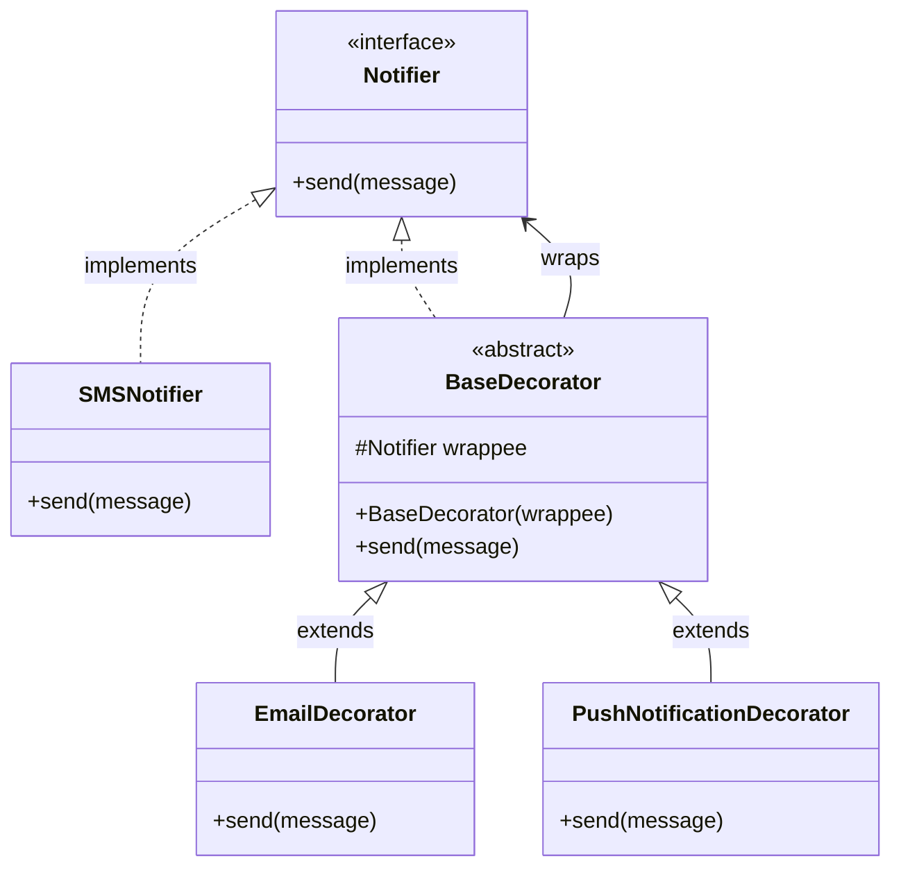

# 🔔 Decorator Pattern — Notification System

Implementation of the Decorator pattern to **stack notification channels** (SMS, Email, Push) on top of each other dynamically.

## Design

- **Notifier** — base interface with `send(message)`
- **SMSNotifier** — concrete base implementation
- **BaseDecorator** — abstract decorator wrapping a `Notifier`
- **EmailDecorator** / **PushNotificationDecorator** — concrete decorators adding behavior

Decorators can be stacked: `new PushNotificationDecorator(new EmailDecorator(new SMSNotifier()))` sends via all three channels.

## 📐 UML Class Diagram



## 📂 Files

```
Notification/
├── Notifier.java                          # Base interface
├── Implementation/
│   └── SMSNotifier.java                   # Concrete component
└── Decorator/
    ├── BaseDecorator.java                 # Abstract decorator
    ├── EmailDecorator.java                # Adds email notification
    └── PushNotificationDecorator.java     # Adds push notification
```
