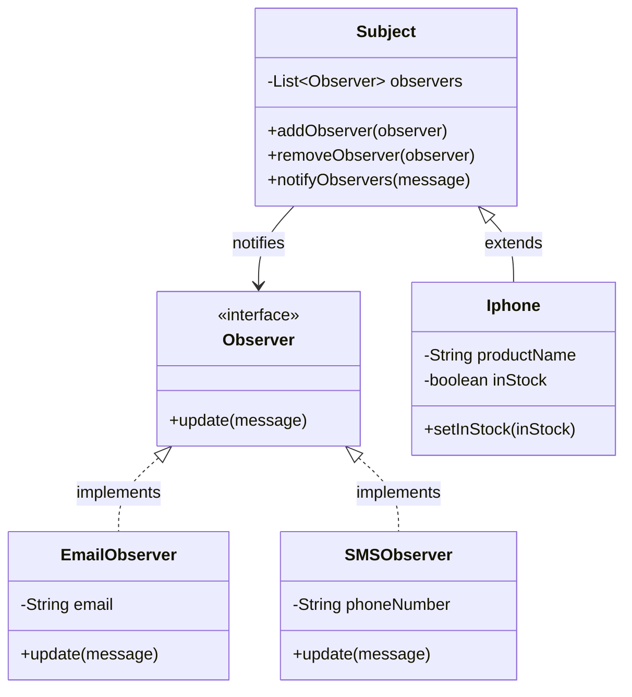

# 👁️ Observer Pattern

Implementation of the Observer design pattern where a **Subject** (observable) notifies multiple **Observers** when its state changes.

## Design

- **Subject** holds a list of observers and notifies them on state change
- **Observer** interface defines the `update()` contract
- **Concrete Observers**: `EmailObserver`, `SMSObserver`
- **Concrete Subject**: `Iphone` (product being observed)

## 📐 UML Class Diagram



## 📂 Files

```
ObserverPattern/
├── Subject.java          # Abstract subject with observer management
├── Iphone.java           # Concrete subject (product)
└── observer/
    ├── Observer.java      # Observer interface
    ├── EmailObserver.java # Notifies via email
    └── SMSObserver.java   # Notifies via SMS
```
