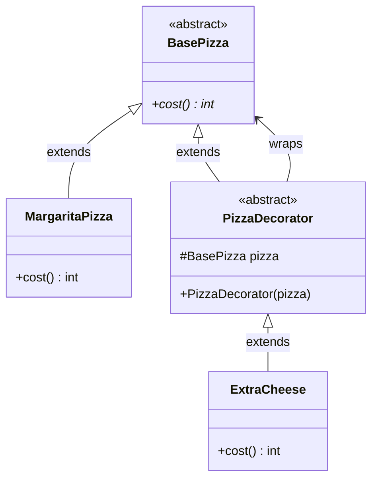

# 🍕 Decorator Pattern — Pizza Toppings

Implementation of the Decorator pattern where **toppings are decorators** stacked on a base pizza to dynamically add cost and description.

## Design

- **BasePizza** — abstract base with `cost()` method
- **MargaritaPizza** — concrete base pizza
- **PizzaDecorator** — abstract decorator wrapping a `BasePizza`
- **ExtraCheese** — concrete decorator adding cheese cost

## 📐 UML Class Diagram



## 📂 Files

```
Pizza/
├── BasePizza.java              # Abstract base
├── MargaritaPizza.java         # Concrete pizza
└── decorator/
    ├── PizzaDecorator.java     # Abstract decorator
    └── ExtraCheese.java        # Concrete topping decorator
```

## Usage Example

```java
BasePizza pizza = new ExtraCheese(new MargaritaPizza());
System.out.println(pizza.cost()); // MargaritaPizza cost + ExtraCheese cost
```
